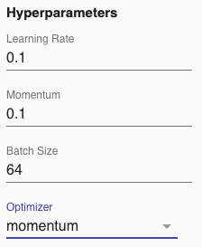

# A Beginners Guide to Hyperparameters
#### Written by: Samantha Schumacher and Mark Sherman, Ph.D.

## HyperParameters 
---
Within a neural network, there are *parameters* and *hyperparameters*. Parameters are considered *internal*, for example, the weights attached to each neuron would be considered a parameter. Parameters are determined by the optimizer through training the model. Hyperparameters, on the other hand, are *external* to the model, meaning we do have direct control over them. Hyperparameters are manually set before the training process begins. The most common hyperparameters you will interact with are the learning rate, momentum, batch size, and optimizers. Once the hyperparameters are set, and you hit the “train” button, the optimizer will use those values to inform decisions it makes while training.

The hyperparameters are located on the far left side of Model Builder and they sometimes change depending on the type of optimizer. 

|                                |                                |                                |
|:------------------------------:|:------------------------------:|:------------------------------:|
|            |       |           |

## Learning Rate 
---
The *learning rate* controls how much we adjust the weights of our neural network. When using gradient descent-based optimizers, the learning rate is a fixed number. Within Model Builder are adaptive learning optimizers (such as Adam) that change the learning rate throughout the training process. A higher learning rate will allow the optimizer to take bigger steps, enabling the model to converge faster. However, you might move too drastically and miss the global minimum altogether. A lower learning rate means we are taking smaller steps therefore, getting a more precise look into the gradient. As a consequence, it will take much more time to converge. For reference, this hyperparameter is normally set within the range of 0.0–1.0.[1]

While there is no perfect fit for setting the learning rate, you can look at the model's loss as an indicator of how well the learning rate is performing.  An appropriate learning rate will immediately begin to improve the model's loss and will get to a suitable accuracy within a reasonable amount of epochs depending on the specific project. For best practice, it is recommended that you start with a lower learning rate and gradually increase it while monitoring your model’s loss along the way. The image below shows that it took the model around 45 epochs to get to a cost of 0.5.

If the loss immediately increases, and continues to increase, that is a sign that the learning rate is too high. It is likely that the optimizer is taking steps that are too big and is stepping over the global minimum. This situation is shown in the chart below, where the loss immediately spikes to 10 after less than 5 epochs.

If our loss function begins to decrease during the first few epochs but plateaus over time this is an indicator that the learning rate is a little too high, but not as drastic as the first scenario. This can be seen below, where the cost spikes to 10 and then drops to 2.5 after a few epochs. The model remains stuck at this cost despite training for a little under 150 epochs. 

If the learning rate is too low it might eventually reach an acceptable loss (somewhere close to zero but will vary depending on the situation), but it will take a very long time. This does not impact the effectiveness of the model, it just becomes unreasonable to use since time is a finite resource. The learning rate in the image below is incredibly low and it took the model over 700 epochs to reach a cost of around 0.5.

In the following image, you can see a visual summary of how to tell if your learning rate is set too high or too low.  

[Understanding learning rates](https://towardsdatascience.com/understanding-learning-rates-and-how-it-improves-performance-in-deep-learning-d0d4059c1c10)

## Batch Size

*Batch size* controls the number of samples the model will work through before the internal parameters are updated. [2] The most common batch sizes are either 32, 64, or 128. The batch size can be the total number of data entries in the dataset, which is sometimes referred to as *vanilla gradient descent*. This optimizer is not used often, especially among large data sets, because it requires a large amount of memory. Smaller batch sizes, for example, 32, are usually preferred because they provide the most stability in training and are small enough for most computers to handle the amount of memory needed. [3] Smaller batch sizes also require less training time. [4]

## Momentum

*Momentum* adds inertia in a direction by remembering past interactions with the gradient.[5] If recent changes to the parameters have been in the same direction, the inertia factor will push future changes in that same direction. This means the optimizer can make changes that are history-aware, and more likely to be better since it is being directed by previous movements. If the model is continuously moving downhill, the momentum will increase since downwards movement means less loss. If the model begins to move uphill the momentum will decrease.[6] This allows the model to quickly move through any plateaus and get pushed out of any local minima. Typically, momentum is set to 0.9.

## Optimizers

*Optimizers* are the algorithms that adjust the weights and bias to minimize loss. Each optimizer approaches this problem differently and will perform better depending on the specific problem.[7] Some optimizers within model builders are based on *Gradient Descent* which uses a static learning rate. Other optimizers are *adaptive*, meaning the learning rate changes during the training process. 

For both approaches, we can think of the gradient as a mountain where the top of the mountain has the most loss and the bottom has the least loss. The model is a blindfolded hiker trying to reach the bottom. The position of the hiker is analogous to the values of the model’s parameters. The hiker begins by moving in a random direction. If this direction is downhill, the hiker senses that it is closer to the bottom, so it will continue to move in this direction, eventually reaching the bottom. During their descent, they can encounter many problems, like getting trapped in a local minima, or taking too long to travel down the mountain. The optimizers below differ based on how they solve these problems.[8]

## “Vanilla” Gradient Descent

Vanilla Gradient descent is not listed on Model Builder, however, it is the predecessor of all the optimizers available to us. Vanilla Gradient Descent trains on the entire training dataset. This is the simplest way to approach training since the model can see the entire gradient, but it has significant real-world obstacles. For example, since it trains on an entire dataset, it requires an enormous amount of memory. Additionally, it uses a static learning rate, so it may take the model a long time to converge.[9] Because of this, Gradient Descent is an unreasonable approach for most machine learning projects. Adaptive optimizers were developed to work around these issues, which will be explained in more detail later on. 

## Stochastic Gradient Descent (SGD)

To combat the memory and time issues associated with Gradient Descent, SGD breaks the data into batches. You can control the size of the batch using the batch size hyperparameter. This lets the model train faster, but can be less accurate. Inaccuracy can occur with larger batch sizes since the optimizer is effectively taking an average across the batch, and larger batches will make individual examples less significant. Training with batches does not guarantee convergence at the global minimum, but we will most likely get a result that is “good enough” in a reasonable time frame. 

The animation below shows how an SGD optimizer interacts with the gradient. It is able to move out of the local minima and land in the general area of the global minimum. Once in the global minimum, it oscillates back and forth for a couple of iterations before landing at the bottom. 

[Visual representation of SGD](https://medium.com/@kaitotally/adam-the-birthchild-of-adagrad-and-rmsprop-b5308b24b9cd#:~:text=RMSProp%20is%20a%20derivation%20of,the%20sum%20of%20its%20gradients)

## SGD with momentum 

This optimizer uses the same approach as SGD except momentum is added. That means the model converges in fewer steps, moving the model out of a local minima or plateau. 

This animation visualizes the benefits of using momentum. Just like with SGD, the optimizer quickly exits the local minima. However, unlike SGD, there is significantly less oscillation around the global minimum.

[Visual representaton of SGD with momentum](https://medium.com/@kaitotally/adam-the-birthchild-of-adagrad-and-rmsprop-b5308b24b9cd#:~:text=RMSProp%20is%20a%20derivation%20of,the%20sum%20of%20its%20gradients)

## Adaptive Gradient Descent (AdaGrad)

Unlike the optimizers mentioned above, *AdaGrad* uses an adaptive learning rate. It also gives each parameter in the model its own individual learning rate. The learning rate is adjusted for each parameter based on how much that parameter has been changed. It uses a sum of squares of all past parameter changes, so the learning rate tends to shrink throughout training. This may create a “vanishing gradient,” where the learning rates get so small that the model might take a very long time to converge. It is standard for the learning rate to be set to 0.1. There is little need to alter this start value since it will change automatically throughout the training process.[10]

## RMSprop

RMSprop is very similar to AdaGrad except for how it calculates the gradient. Rather than adding the sum of all the changes, RMSprop values older changes progressively lower, so older points in history have little to no impact on the current changes being made.[11] This technique addresses the vanishing gradient problem in AdaGrad. RMSprop has all the benefits of AdaGrad, except it is more resistant to a slowdown from a vanishing gradient. 

## AdaDelta

This optimizer is an extension to AdaGrad that also addresses the vanishing gradient problem. Rather than accumulating all squared gradients, it is restricted to some fixed number using the gamma hyperparameter.[12] This way the model is only looking at a moving window of gradients rather than all past gradients. Gamma should be set somewhere between 0–1, however, it should never be set exactly to 0 or 1. A larger Gamma value corresponds to a larger window of past gradients. 

## Adaptive Moment Estimation (Adam)
	
Adam is a combination of RMSprop and momentum. As in RMSprop, Adam uses a moving window of past parameter changes that is denoted by the Beta1 and Beta2 hyperparameters. The Beta1 value controls momentum. Beta2 replaces the Gamma hyperparameter from RMSprop, which controls the window size. This allows the model to take big enough steps using momentum, while also limiting any oscillation around the global minimum.[13] Adam works well in many different situations and is one of the best performing optimizers.[14] The Beta1 and Beta2 hyperparameters should be set within the range 0 ≤ B < 1, however, the creators of the Adam optimizer recommend Beta1 be set to 0.9 and Beta2 be set to 0.999.[15] You can see the benefits of the Adam optimizer in the graphic below. 

[Visual representation of Adam 0ptimizer](https://medium.com/@kaitotally/adam-the-birthchild-of-adagrad-and-rmsprop-b5308b24b9cd#:~:text=RMSProp%20is%20a%20derivation%20of,the%20sum%20of%20its%20gradients)

## AdaMax

AdaMax is an extension of Adam that calculates the gradient a little differently. This optimizer is more resistant to changes in the gradient. It withholds large weight changes for extreme situations.[16] This optimizer does not work well in every environment. Typically, it performs best in more complex gradients. As a result, it is not always a good replacement for Adam. The creators of Adamax recommend that Beta1 be set to 0.9 and Beta2 set to 0.999, however, Beta1 and Beta2 can be set in the range 0 ≤ B < 1.[17]

### References 

Alabdullatef, Layan. [“Complete Guide to Adam Optimization.”](https://towardsdatascience.com/complete-guide-to-adam-optimization-1e5f29532c3d) Medium. Towards Data Science, September 2, 2020.  

Brownlee, Jason. [“Difference between a Batch and an Epoch in a Neural Network.”](https://machinelearningmastery.com/difference-between-a-batch-and-an-epoch/.) Machine Learning Mastery, October 25, 2019. 

Brownlee, Jason. [“Gradient Descent with Momentum from Scratch.”](https://machinelearningmastery.com/gradient-descent-with-momentum-from-scratch/#:~:text=Momentum%20is%20an%20extension%20to,spots%20of%20the%20search%20space.) Machine Learning Mastery, October 11, 2021.  

Brownlee, Jason. [“How to Control the Stability of Training Neural Networks with the Batch Size.”](https://machinelearningmastery.com/how-to-control-the-speed-and-stability-of-training-neural-networks-with-gradient-descent-batch-size/#:~:text=Batch%20size%20controls%20the%20accuracy,stability%20of%20the%20learning%20proces) Machine Learning Mastery, August 27, 2020.   

Ng, Andrew. [“Adam Optimization Algorithm (C2W2L08).”](https://www.youtube.com/watch?v=JXQT_vxqwIs.) YoutTube, August 25, 2020. 

[“Optimization Algorithms in Neural Networks.”](https://www.kdnuggets.com/2020/12/optimization-algorithms-neural-networks.html) KDnuggets, December 18, 2020. 

Andrea Perlato, [“The Learning Rate,”](https://www.andreaperlato.com/theorypost/the-learning-rate/#:~:text=The%20range%20of%20values%20to,starting%20point%20on%20your%20problem.) AndreaPerlato.com.

P, Bipin Krishnan. [“When and Why Are Batches Used in Machine Learning?”](https://medium.com/analytics-vidhya/when-and-why-are-batches-used-in-machine-learning-acda4eb00763) Medium. Analytics Vidhya, April 22, 2022. 

Prakhar. [“Intuition of Adam Optimizer.”](https://www.geeksforgeeks.org/intuition-of-adam-optimizer/.) GeeksforGeeks, October 24, 2020. 

Rohrer, Brandon. [“How Optimization for Machine Learning Works, Part 1.”](https://www.youtube.com/watch?v=x6f5JOPhci0.) YouTube. YouTube, October 14, 2018. 

Ruder, Sebastian. [“An Overview of Gradient Descent Optimization Algorithms.”](https://ruder.io/optimizing-gradient-descent/index.html#adadelta.) Sebastian Ruder. Sebastian Ruder, March 20, 2020. 

Shen, Kevin. [“Effect of Batch Size on Training Dynamics.”](https://medium.com/mini-distill/effect-of-batch-size-on-training-dynamics-21c14f7a716e) Medium. Mini Distill, June 19, 2018. 

Tota, Kaivalya. [“Adam: The Birthchild of Adagrad and RMSProp.”](https://medium.com/@kaitotally/adam-the-birthchild-of-adagrad-and-rmsprop-b5308b24b9cd#:~:text=RMSProp%20is%20a%20derivation%20of,the%20sum%20of%20its%20gradients.) Medium. Medium, April 22, 2020.  

Versloot, Christian. [“Extensions to Gradient Descent from Momentum to AdaBound.”](https://github.com/christianversloot/machine-learning-articles/blob/main/extensions-to-gradient-descent-from-momentum-to-adabound.md) GitHub, February 15, 2022.   

[1]: https://www.andreaperlato.com/theorypost/the-learning-rate/#:~:text=The%20range%20of%20values%20to,starting%20point%20on%20your%20problem
[2]:https://machinelearningmastery.com/difference-between-a-batch-and-an-epoch/
[3]:https://machinelearningmastery.com/how-to-control-the-speed-and-stability-of-training-neural-networks-with-gradient-descent-batch-size/#:~:text=Batch%20size%20controls%20the%20accuracy,stability%20of%20the%20learning%20process
[4]:https://medium.com/analytics-vidhya/when-and-why-are-batches-used-in-machine-learning-acda4eb00763
[5]:https://machinelearningmastery.com/gradient-descent-with-momentum-from-scratch/#:~:text=Momentum%20is%20an%20extension%20to,spots%20of%20the%20search%20space
[6]:https://medium.com/analytics-vidhya/when-and-why-are-batches-used-in-machine-learning-acda4eb00763
[7]:https://www.kdnuggets.com/2020/12/optimization-algorithms-neural-networks.html
[8]:https://www.youtube.com/watch?v=x6f5JOPhci0
[9]:https://www.kdnuggets.com/2020/12/optimization-algorithms-neural-networks.html
[10]:https://www.kdnuggets.com/2020/12/optimization-algorithms-neural-networks.html
[11]:https://medium.com/@kaitotally/adam-the-birthchild-of-adagrad-and-rmsprop-b5308b24b9cd#:~:text=RMSProp%20is%20a%20derivation%20of,the%20sum%20of%20its%20gradients
[12]:https://ruder.io/optimizing-gradient-descent/index.html#adadelta
[13]:https://www.geeksforgeeks.org/intuition-of-adam-optimizer/
[14]:https://www.youtube.com/watch?v=JXQT_vxqwIs
[15]:https://towardsdatascience.com/complete-guide-to-adam-optimization-1e5f29532c3d
[16]:https://towardsdatascience.com/complete-guide-to-adam-optimization-1e5f29532c3d
[17]:https://arxiv.org/pdf/1412.6980.pdf